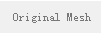
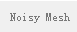
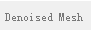
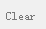

##Guided Denoising

This code implements the denoising algorithm in the following paper:

* Wangyu Zhang, Bailin Deng, Juyong Zhang, Sofien Bouaziz, Ligang Liu. <b>Guided mesh normal filtering</b>. Pacific Graphics 2015.

It also implements the denoising methods from the following papers for comparison:

* Shachar Fleishman, Iddo Drori, and Daniel Cohen-Or. 2003. <b>Bilateral mesh denoising</b>. ACM Trans. Graph. 22, 3 (July 2003), 950-953.

* Thouis R. Jones, Frédo Durand, and Mathieu Desbrun. 2003. <b>Non-iterative, feature-preserving mesh smoothing</b>. ACM Trans. Graph. 22, 3 (July 2003), 943-949.

* Xianfang Sun, P. L. Rosin, R. R. Martin, and F. C. Langbein. 2007. <b>Fast and Effective Feature-Preserving Mesh Denoising</b>. IEEE Transactions on Visualization and Computer Graphics 13, 5 (September 2007), 925-938.

* Youyi Zheng, Hongbo Fu, Oscar Kin-Chung Au, and Chiew-Lan Tai. 2011. <b>Bilateral Normal Filtering for Mesh Denoising</b>. IEEE Transactions on Visualization and Computer Graphics 17, 10 (October 2011), 1521-1530.

* Lei He and Scott Schaefer. 2013. <b>Mesh denoising via L0 minimization</b>. ACM Trans. Graph. 32, 4, Article 64 (July 2013).

The code has been tested on Windows (with Qt 5.3 and Visual Studio 2013), and on Ubuntu (with Qt 5.2.1 and GCC 4.8.2).

###Compiling the source code:
Make sure you have Qt (https://www.qt.io) installed . Then open the file src/MeshDenoising.pro with QtCreator, and build the source code. 

###Usage
The following table explains the functionality for the GUI icons.

|icon       | functionality |
|---------- | ----------   |
| | read a mesh from file (supports obj, ply and off files) |
| | save the mesh to file |
| | render vertices of the mesh |
| | render edges of the mesh |
| | render faces of the mesh |
|| change the background color of the OpenGL area |
| | information about this software|
| |show the original mesh|
||show the noisy mesh|
||show the denoised mesh|
||clear the mesh|

###Parameters
Please see the [supplementary material](http://staff.ustc.edu.cn/~juyong/Papers/GuidedFilterSupp.pdf) for details about the parameters in each mesh denoising algorithm or see the code of each algorithm (function <b>initParameters()</b> in .cpp).

###License
This software is released under GNU LGPL V3.

###Contact
If you have any question, please contact Wangyu Zhang <<a href="mailto:zhwangyu@mail.ustc.edu.cn">zhwangyu@mail.ustc.edu.cn</a>>.

Hope you enjoy it.